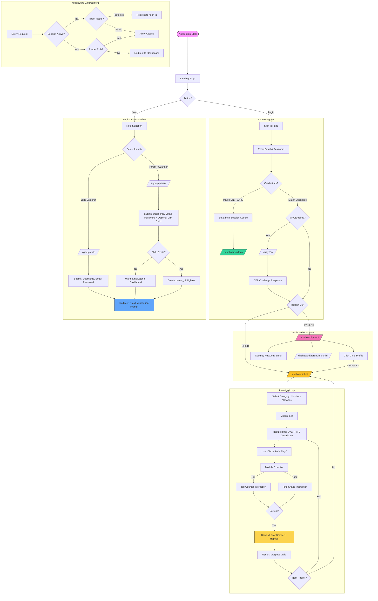

# LearnSpark Precise User Flow

This document provides a high-fidelity mapping of the LearnSpark platform's logic, from initial role selection to secure learning sessions and data persistence.

## Precision Details

### 1. The Admin Bypass Mechanism
Unlike standard users stored in the `profiles` table, the **System Administrator** role is handled via environmental injection.
- **Trigger**: `process.env.ADMIN_EMAIL` and `process.env.ADMIN_PASSWORD`.
- **Enforcement**: Sets an `httpOnly` cookie named `admin_session`.
- **Middleware**: Explicitly checks for this cookie to grant access to `/dashboard/admin` even if no Supabase Auth session is active.

### 2. Parent-Child Linking (Atomic vs. Deferred)
- **Atomic Linking**: During registration, if a parent provides a valid child username, the link is created immediately upon account creation.
- **Deferred Linking**: Parents can link children at any time from their dashboard via a dedicated search-and-add interface.

### 3. MFA Logic
Security is tiered. MFA is **Parent-Optional** (enrolled via Security Hub) but **Enforced upon Login** if factors exist.
1.  Sign-In succeeds via Password (`aal1`).
2.  System checks for `verified` factors.
3.  If found, the session stays in a "restricted" state until verified via `/verify-2fa` (`aal2`).

### 4. Learning State Persistence
Progress is tracked using a resolution layer.
- **Local Module ID** (e.g., `num-1`) is mapped to a **Database Module UUID** by title.
- This ensures that if the static module data changes (e.g., new SVG or prompt), the child's historical progress remains pinned to the correct database record.
