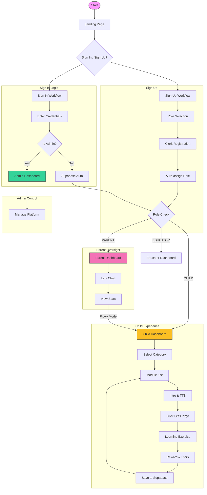

# LearnSpark User Flow

This diagram illustrates the primary user journeys within the LearnSpark platform.

```mermaid
graph TD
    %% Entry & Auth
    Start([Start]) --> Landing[Landing Page]
    Landing --> SignIn{Sign In / Sign Up?}
    
    SignIn --> SignUpFlow[Sign Up Workflow]
    SignIn --> SignInFlow[Sign In Workflow]

    %% Sign Up Workflow
    subgraph Sign Up
        SignUpFlow --> RoleSelect[Role Selection]
        RoleSelect --> ClerkSignUp[Clerk Registration]
        ClerkSignUp --> SetRole[Auto-assign Role]
        SetRole --> RoleCheck
    end

    %% Sign In Workflow
    subgraph Sign In Logic
        SignInFlow --> AuthInput[Enter Credentials]
        AuthInput --> AdminCheck{Is Admin?}
        AdminCheck -- Yes --> AdminDash[Admin Dashboard]
        AdminCheck -- No --> SupabaseAuth[Supabase Auth]
        SupabaseAuth --> RoleCheck{Role Check}
    end

    %% dashboards
    RoleCheck -- CHILD --> ChildDash[Child Dashboard]
    RoleCheck -- PARENT --> ParentDash[Parent Dashboard]
    RoleCheck -- EDUCATOR --> EducatorDash[Educator Dashboard]

    %% Child Learning Flow
    subgraph Child Experience
        ChildDash --> ModuleSelect[Select Category]
        ModuleSelect --> ModuleList[Module List]
        ModuleList --> ActivityIntro[Intro & TTS]
        ActivityIntro --> LetPlay[Click Let's Play!]
        LetPlay --> ActivityExercise[Learning Exercise]
        ActivityExercise --> Reward[Reward & Stars]
        Reward --> SaveProgress[Save to Supabase]
        SaveProgress --> ModuleList
    end

    %% Parent Oversight Flow
    subgraph Parent Oversight
        ParentDash --> LinkChild[Link Child]
        LinkChild --> ViewStats[View Stats]
        ViewStats -- Proxy Mode --> ChildDash
    end

    %% Admin Management Flow
    subgraph Admin Control
        AdminDash --> ManageContent[Manage Platform]
    end

    %% Styles
    style Start fill:#f9f,stroke:#333
    style ChildDash fill:#fbbf24,stroke:#333
    style ParentDash fill:#f472b6,stroke:#333
    style AdminDash fill:#34d399,stroke:#333
```
